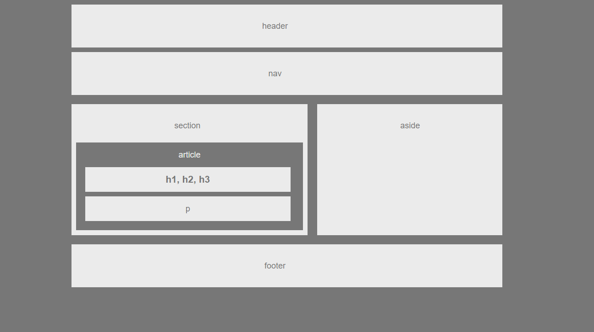

# **HW-Wireframe**

## *Concepts: Wireframing with HTML and CSS*

---

`In this assignment, we were tasked to create a page skeleton using HTML and CSS and the following image as a guide.`

## Assignment:

---

	1. Your HTML should have each of the following sections:
    - Header
    - Nav
    - Aside
    - Section
    - Article
    - Headers
    - Paragraph
    2.  Your CSS should have the styles for each of the following elements:
    - Body
    - Header, nav, and footer
    - Section
    - Aside
    - .clear
    - Your text elements h1, p, etc.
    3. The colors used in your final layout should be:
    - Background: #777
    - Content: #ebebeb
    4. The widths of each section should be:
    - body: 960px
    - section: 495px
    5. The fonts used in the layout should be:
    - font-family:'Arial', 'Helvetica Neue', Helvetica, sans-serif;
    - font-size: 18px

    ## Copyright

    Coding Boot Camp © 2016. All Rights Reserved.

---

## Deployment

The project was deployed to GitHub pages as:
[HW-Wireframe.](https://flowmar.github.io/HW-Wireframe)

The source code is located [here](https://github.com/flowmar/HW-Wireframe).

---

## About the Author

### Omar Imam

Find me on: [GitHub](https://github.com/flowmar/)
Portfolio: [Flowmar](https://flowmar.gwiddle.co.uk/)
Connect with me on [LinkedIn](https://linkedin.com/in/flowmar)